# Chakravyuha — System Architecture

[](https://fastapi.tiangolo.com)
[](https://onnxruntime.ai)
[](https://github.com/facebookresearch/faiss)
[](https://react.dev)
[](https://docker.com)
[](https://mongodb.com/atlas)
[](https://redis.io)
[](https://postgresql.org)
[]()
[]()

> Full architecture reference for **Chakravyuha** — production AI governance infrastructure.
> 11 rings · 4 planes · 6 regulation plugins · 97 clauses · 35 routes · CPU-only.

---

## Table of Contents

- [System Overview](#system-overview)
- [The 4 Planes](#the-4-planes)
- [11-Ring Pipeline](#11-ring-pipeline)
- [Backend Engine Layout](#backend-engine-layout)
- [Semantic Engine Internals](#semantic-engine-internals)
- [Constitutional Retrieval (Ring 3)](#constitutional-retrieval-ring-3)
- [Policy Engine + Composer](#policy-engine--composer)
- [Atomic Commit Gate (Ring 8)](#atomic-commit-gate-ring-8)
- [Audit Vault (Ring 11)](#audit-vault-ring-11)
- [HITL Queue (Ring 10)](#hitl-queue-ring-10)
- [Multi-Tenant Architecture](#multi-tenant-architecture)
- [Frontend Architecture](#frontend-architecture)
- [SDK Architecture](#sdk-architecture)
- [Data Flow Diagrams](#data-flow-diagrams)
- [Database Schema](#database-schema)
- [AWS Deployment Architecture](#aws-deployment-architecture)
- [Security Architecture](#security-architecture)
- [Observability](#observability)
- [Failure Modes & Fallbacks](#failure-modes--fallbacks)

---

## System Overview

Chakravyuha is a four-plane system: **Edge**, **Control**, **Reasoning**, **Data**. Each plane is independently scalable; the interfaces between them are stable enough that any plane can be swapped without rewriting the others.

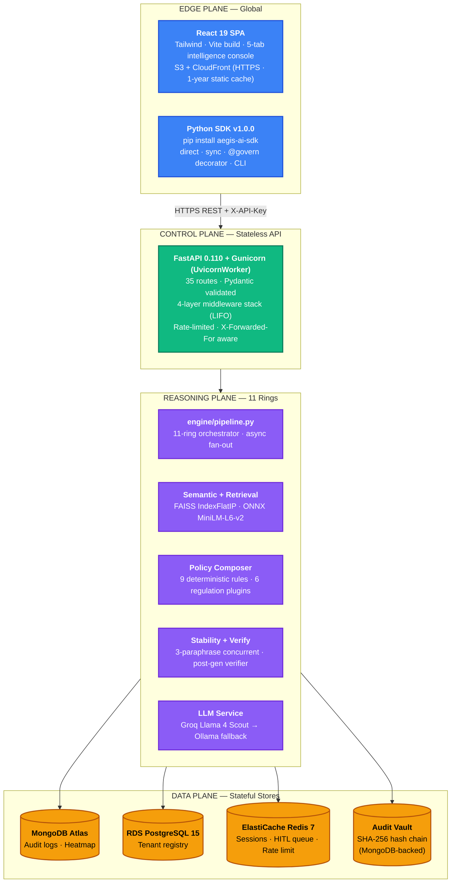

---

## The 4 Planes

| Plane | Statefulness | Scaling Strategy | Failure Domain |
|---|---|---|---|
| **Edge** | Stateless | CDN edge nodes, infinite horizontal | Per-region |
| **Control** | Stateless | ECS Fargate auto-scaling on CPU | Per-task |
| **Reasoning** | In-memory state (FAISS, ONNX) | Vertical first, then sharded by tenant | Per-pod |
| **Data** | Persistent | Managed services (Atlas, ElastiCache, RDS) | Per-cluster |

**Why split this way:** the Reasoning plane is the only place that holds large in-memory state (the FAISS index, ONNX model, and PII regex graph). Splitting it from the Control plane lets Chakravyuha autoscale lightweight HTTP handling without thrashing the embeddings cache.

---

## 11-Ring Pipeline

The orchestrator is `engine/pipeline.analyze_query()`. Order, concurrency, and skip conditions are explicit:

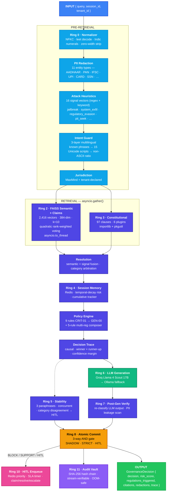

**Concurrency model:**
- FAISS retrieval is wrapped in `asyncio.to_thread()` so it never blocks the event loop.
- Ring 2 (semantic) and Ring 3 (constitutional retrieval) run inside `asyncio.gather()` — wall-clock latency is `max(t_semantic, t_ring3)`, not their sum.
- Ring 5 stability check fires three paraphrase passes concurrently.

**Risk score formula:**
```
risk = semantic(0.6) + session(0.2) + policy(0.2)
```

**Modes** (set via `GOVERNANCE_MODE`):
- `SHADOW` — log only; for A/B baselines and dark-launches.
- `STRICT` — production block-on-violation.
- `HITL` — every borderline decision routed to human reviewer with SLA timer.

---

## Backend Engine Layout

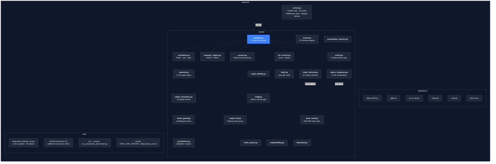

---

## Semantic Engine Internals

`engine/semantic_engine.py` is the primary classifier.

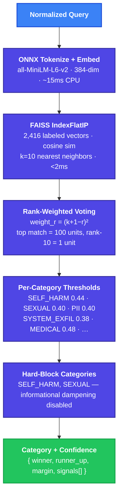

**Why rank-weighted voting?** Standard FAISS k-NN classifiers use flat similarity-sum voting, which suffers from *cluster bias*: a cluster of moderately-similar harmful examples can outvote a single high-confidence SAFE match. Quadratic rank weighting `(k+1−rank)²` makes the top match 100× more influential than the least-similar match — driving false positives from 35 → 4 in a single change.

**Dynamic per-tenant thresholds:** every tenant can supply `threshold_overrides` to relax or tighten any category, while still going through the legal-floor composition rules.

---

## Constitutional Retrieval (Ring 3)

`engine/ring3_retrieval.py` runs FAISS over the regulatory corpus rather than the harm corpus.

```mermaid
flowchart LR
    NQ["Normalized Query"]
    RING3["<b>Ring 3 Retriever</b><br/>FAISS IndexFlatIP over 97 clauses<br/>k=5 most-relevant clauses"]

    subgraph Plugins["6 Regulation Plugins (importlib + pkgutil)"]
        direction TB
        DPDP["<b>dpdp_2023.py</b><br/>Aadhaar §4 · biometric §9"]
        GDPR["<b>gdpr.py</b><br/>Art 4(1) · Art 9 · Art 22"]
        EUAI["<b>eu_ai_act.py</b><br/>Art 5 prohibited · Art 6 high-risk"]
        HIPAA["<b>hipaa.py</b><br/>§164.514 PHI · safe harbor"]
        CCPA["<b>ccpa.py</b><br/>§1798 sale-of-data"]
        SEBI["<b>sebi_rbi.py</b><br/>Insider Trading Regs · UPI Frd."]
    end

    OUT["<b>Citations[]</b><br/>{ regulation, clause_id, severity, penalty, text }"]

    NQ --> RING3 --> Plugins --> OUT

    classDef ring fill:#4f46e5,stroke:#3730a3,stroke-width:2px,color:#fff;
    classDef plugin fill:#8b5cf6,stroke:#6d28d9,stroke-width:2px,color:#fff;
    classDef output fill:#22c55e,stroke:#16a34a,stroke-width:2px,color:#fff;
    class RING3 ring;
    class DPDP,GDPR,EUAI,HIPAA,CCPA,SEBI plugin;
    class OUT output;
```

**Plugin contract:** each plugin exposes `clauses: list[Clause]` and `match(category, signals) -> list[CitedClause]`. New regulations are added by dropping a file in `regulations/` — no core changes.

---

## Policy Engine + Composer

`engine/policy.py` runs nine deterministic rules; `engine/policy_composer.py` composes results across plugins.

| Rule ID | Trigger | Default Action |
|---|---|---|
| `CRIT-01` | Hard-block category + high confidence | BLOCK + cite |
| `CRIT-02` | PII exploitation pattern | BLOCK + cite |
| `HIGH-01` | Regulatory evasion signals | BLOCK + cite |
| `HIGH-02` | System exfiltration / jailbreak | BLOCK + cite |
| `MED-01` | Borderline + ambiguous intent | HITL or SUPPORT |
| `MED-02` | Session escalation pattern | HITL |
| `LOW-01` | Soft policy tag | ALLOW + redact |
| `INFO-01` | Educational framing on non-hard-block | ALLOW |
| `GEN-00` | Default | ALLOW |

**5-rule composition** when multiple plugins fire on the same query:
1. **Most-restrictive wins** — DPDP_CRITICAL beats GDPR_PERSONAL
2. **Legal floor** — no plugin can lower another's minimum bar
3. **Tenant restricts only** — tenant config can tighten, never relax
4. **All applicable plugins audited** — not just the winner
5. **Full citation in every block** — every block message names its article

---

## Atomic Commit Gate (Ring 8)

`engine/ring8.py` is the final 3-way AND gate. Without it, an attacker could walk a query around any *single* check.

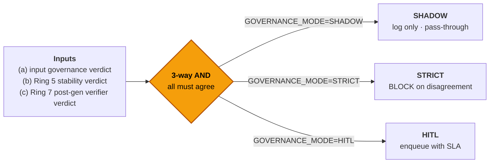

**Disagreement is the safety surface.** A single ring approving with high confidence is not enough — an adversarially crafted query can fool any one ring, but rarely all three simultaneously.

---

## Audit Vault (Ring 11)

`engine/audit_vault.py` writes every decision to a SHA-256 hash chain so any post-hoc tampering is detectable.

```
entry_n.hash = SHA-256( entry_n.payload || entry_{n-1}.hash )
```

**OOM-safe construction:**
- Only `_chain_head` (32 bytes) is held in memory
- Verification reads MongoDB cursor in a stream — never loads the chain into RAM
- Independent verifier exposed at `GET /api/vault/verify`
- Legal discovery export at `GET /api/vault/export` (admin-key + date range)

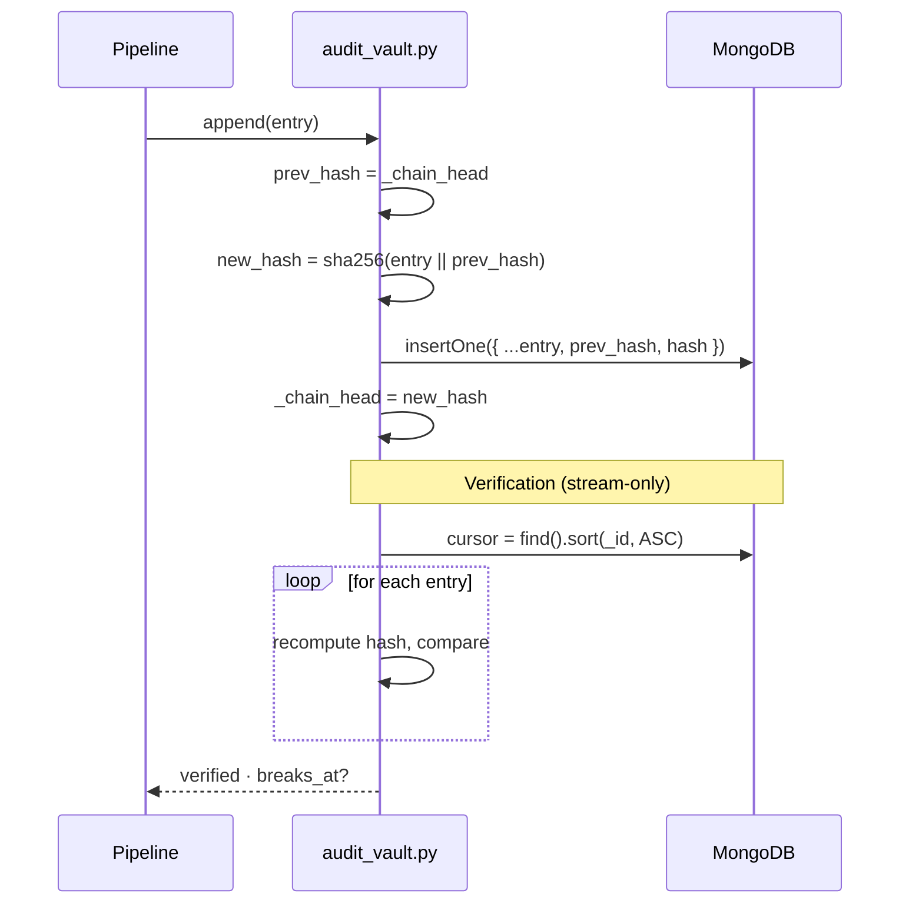

---

## HITL Queue (Ring 10)

`engine/ring10_hitl.py` is a Redis priority queue with SLA timers.

| State | Description |
|---|---|
| `pending` | Newly enqueued, not yet claimed |
| `in_review` | Claimed by an admin |
| `resolved` | Approved or denied with note |
| `breached` | SLA timer expired |
| `escalated` | Bumped to higher priority lane |

Endpoints: `/api/hitl/{queue,stats,breaches,claim,resolve}` — all admin-key gated, all audit-logged.

---

## Multi-Tenant Architecture

`engine/tenant.py` is a PostgreSQL-backed registry with a bounded LRU cache.

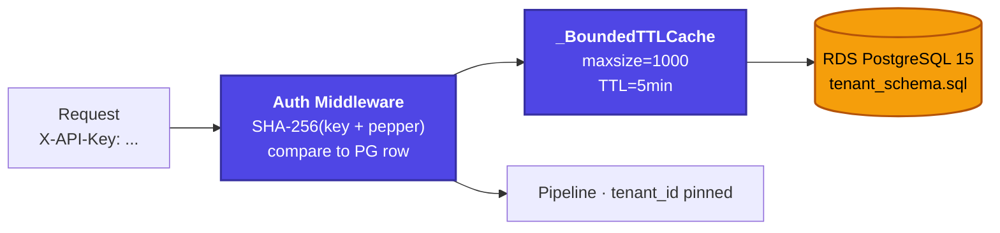

- **Hashing:** SHA-256 + per-tenant pepper (defends against BOLA / rainbow tables)
- **Bounded cache:** LRU eviction prevents memory growth on hostile tenant churn
- **Demo fallback:** if `POSTGRES_URL` is unset the registry runs in single-tenant demo mode (the live demo runs in this mode today; production deployment switches it on)
- **Per-tenant policy patch:** `PATCH /api/admin/tenants/{id}/policy` updates threshold overrides + plugin enablement; all changes audited.

---

## Frontend Architecture

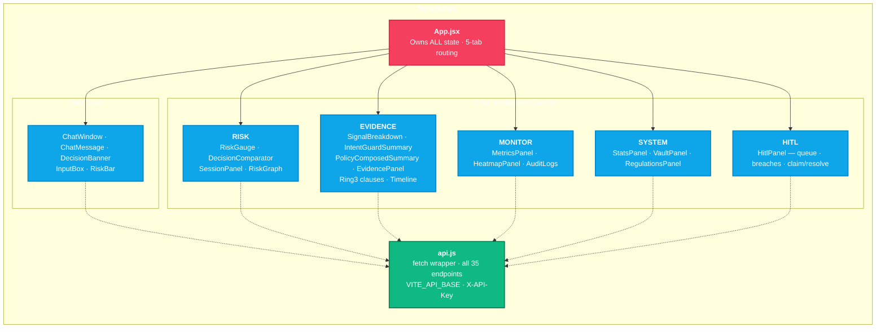

**State ownership:** `App.jsx` owns *everything*. No component manages state it doesn't own — every panel is independently testable and prop-driven.

**Build target:** Vite → `dist/` → `aws s3 sync dist/ s3://<bucket> --delete` → CloudFront invalidate. Long-lived `/assets/*` cache, no-store on the API behavior.

---

## SDK Architecture

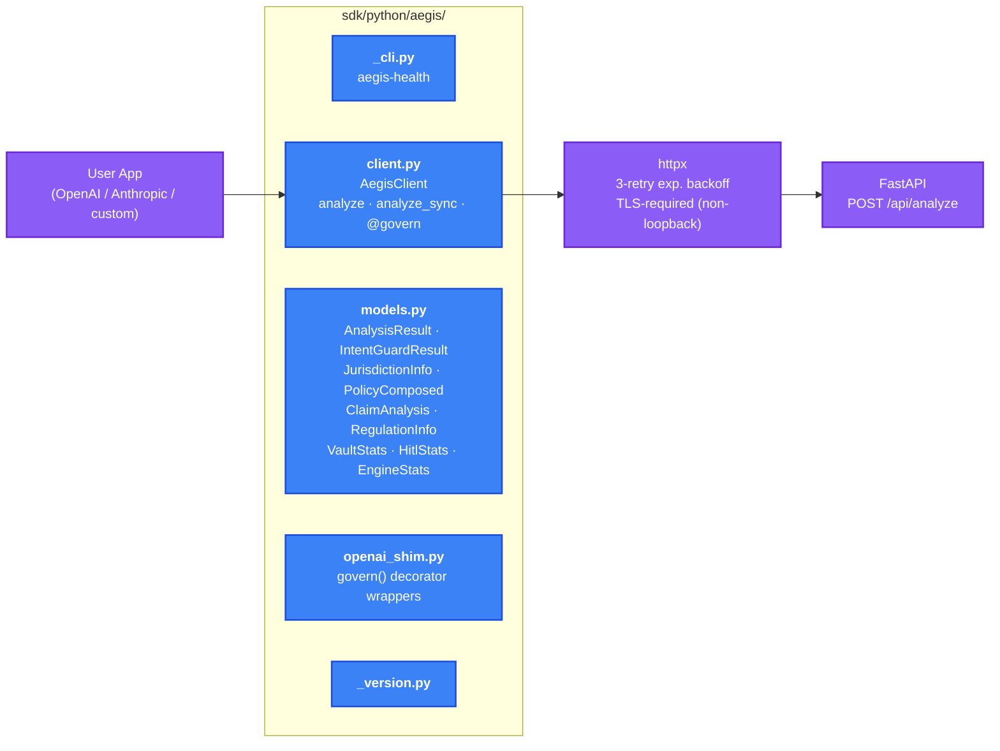

**Optional extras** in `pyproject.toml`:
- `[openai]` → adds `openai>=1.0.0`
- `[anthropic]` → adds `anthropic>=0.25.0`
- `[full]` → both shims

---

## Data Flow Diagrams

### Decision flow — query governance

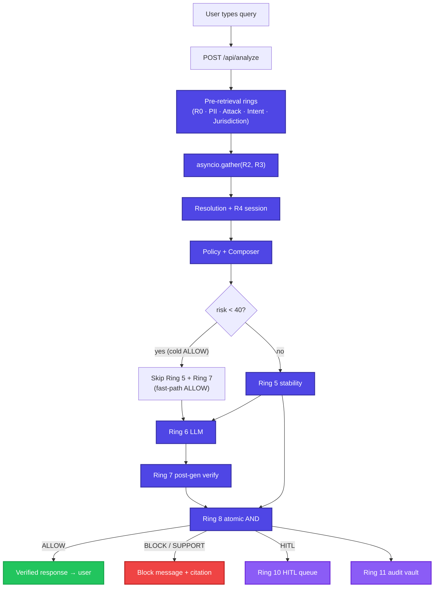

### Compliance report flow

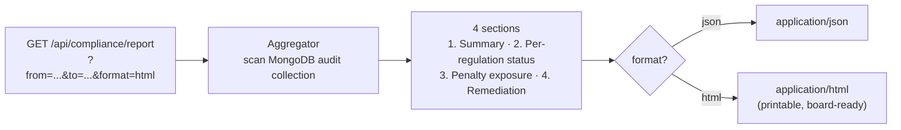

---

## Database Schema

### MongoDB · `governance_logs`

**`audit_logs`**
```json
{
  "_id": "ObjectId",
  "tenant_id": "acme-corp",
  "session_id": "sess-...",
  "query": "raw query (PII redacted before write)",
  "decision": "BLOCK",
  "risk_score": 0.94,
  "confidence": 0.88,
  "regulations_triggered": ["DPDP_2023", "GDPR"],
  "category": "PII",
  "pii_entities": ["AADHAAR"],
  "explanation": "DPDP Act 2023 §4 — biometric exploitation…",
  "trace": { "winner": "...", "runner_up": "...", "margin": 0.21 },
  "timestamp": "2026-05-09T10:30:00Z",
  "processing_time_ms": 16,
  "ring_timings_ms": { "R0":0.1, "R2":15.4, "R3":12.1, "R7":13.8, "R8":0.2 }
}
```

**`audit_vault`** (hash chain)
```json
{
  "_id": "ObjectId",
  "seq": 423901,
  "tenant_id": "acme-corp",
  "payload_hash": "sha256:...",
  "prev_hash": "sha256:...",
  "hash": "sha256:..."
}
```

**`heatmap_counters`** — per-(tenant, regulation, category, decision, day) counters.

### PostgreSQL · `aegis`

`engine/tenant_schema.sql` defines `tenants`, `tenant_keys`, `tenant_policies`, `tenant_audit`. Bounded LRU cache fronts hot reads.

---

## AWS Deployment Architecture

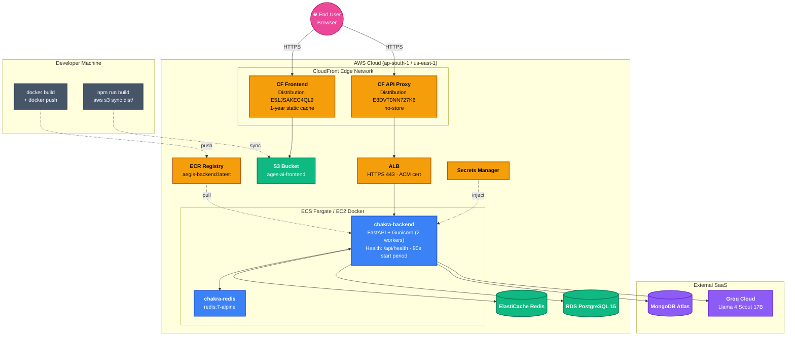

### Deployment pipeline

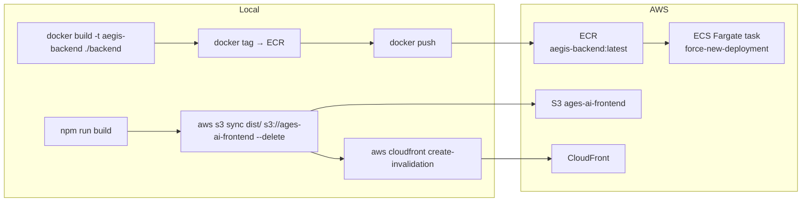

Full step-by-step in [`backend/AWS_DEPLOYMENT_PLAN.md`](../backend/AWS_DEPLOYMENT_PLAN.md).

---

## Security Architecture

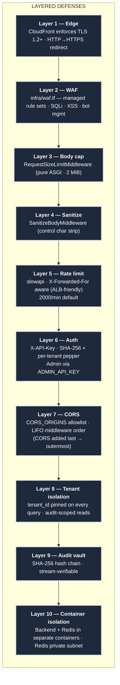

**Secret hygiene:** all secrets via `.env` (gitignored), AWS Secrets Manager in production. `.dockerignore` excludes `.env` from the image. No secrets in code, no secrets in image.

---

## Observability

| Channel | Endpoint / Surface |
|---|---|
| **JSON metrics** | `GET /api/metrics` — requests, errors, P50/P95/P99 latency |
| **Prometheus** | `GET /metrics` — text exposition (counter / histogram / gauge) |
| **Per-ring timings** | embedded in every `audit_logs` entry (`ring_timings_ms`) |
| **Heatmap** | `GET /api/heatmap` — per-(regulation, category, decision) counters |
| **Vault verification** | `GET /api/vault/verify` — full hash-chain integrity check |
| **HITL stats** | `GET /api/hitl/stats` — queue depth, SLA breach count |
| **Health** | `GET /api/health` — engine_ready, env status, tenant |
| **Stats** | `GET /api/stats` — FAISS vectors loaded, Ring3 clauses, plugin count |

---

## Failure Modes & Fallbacks

Every dependency has a defined degradation path. **The engine never returns 500 because a backing service is down.**

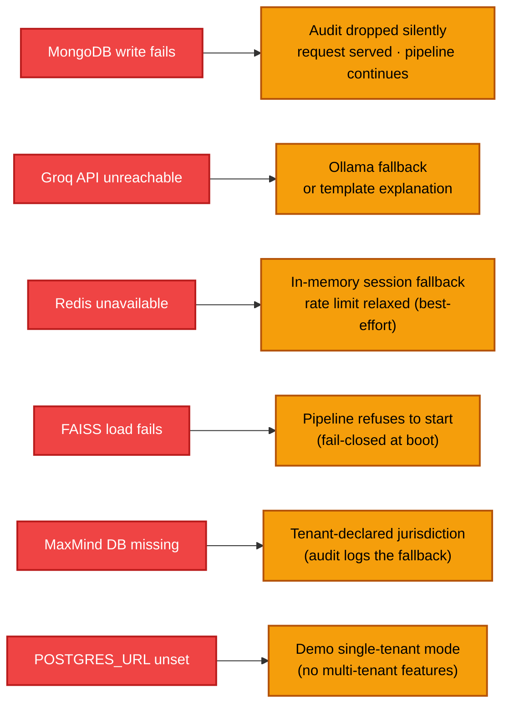

**The one fail-closed rule:** if the FAISS index can't load at startup, the process refuses to serve traffic. There is no degraded governance — either we're live with full pipeline, or we don't accept queries. This is enforced by `engine/startup_validator.py`.

---

*Chakravyuha V3 — Production AI governance infrastructure · CPU-only · ~16ms decisions · 6 regulations · 35 routes · [Back to README](../README.md)*
