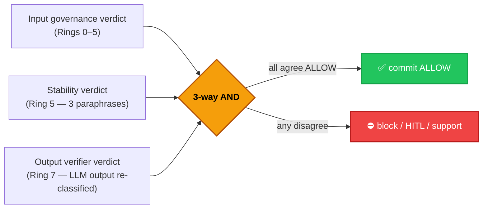
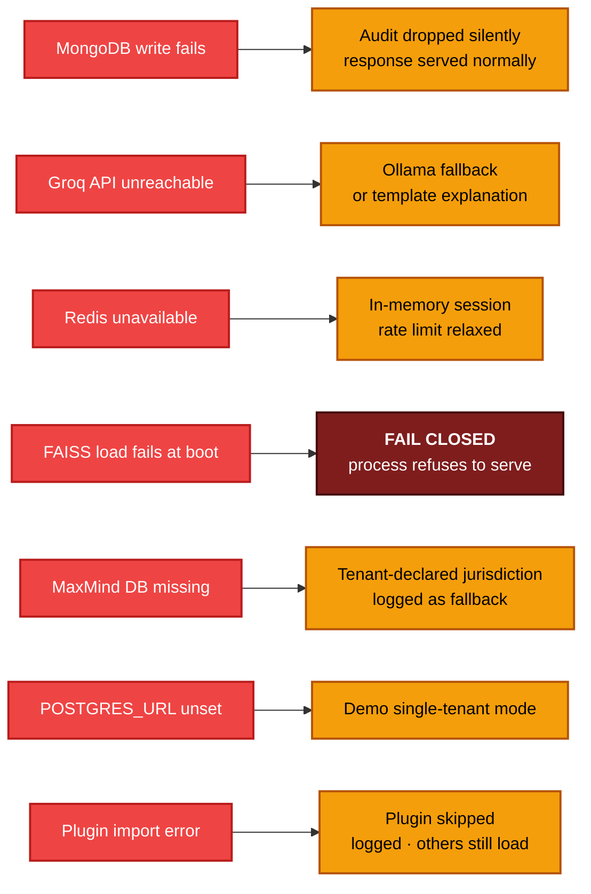

# Chakravyuha — Design Document

[]()
[]()
[](https://github.com/facebookresearch/faiss)
[](https://groq.com)
[]()
[]()
[]()

> Design decisions, principles, and the rationale behind every major technical choice in **Chakravyuha** — including the ones we almost got wrong.

---

## Table of Contents

- [Design Philosophy](#design-philosophy)
- [Problem Framing](#problem-framing)
- [Core Design Decisions](#core-design-decisions)
- [Semantic Engine Design](#semantic-engine-design)
- [Regulation-as-Plugin Design](#regulation-as-plugin-design)
- [Atomic 3-Way Commit Design](#atomic-3-way-commit-design)
- [Audit Vault Design](#audit-vault-design)
- [Multi-Tenancy Design](#multi-tenancy-design)
- [API Design](#api-design)
- [SDK Design](#sdk-design)
- [Frontend Design](#frontend-design)
- [Infrastructure Design](#infrastructure-design)
- [Failure & Fallback Design](#failure--fallback-design)
- [Design Trade-offs](#design-trade-offs)

---

## Design Philosophy

Chakravyuha was designed around **five principles**:

| Principle | What it means |
|---|---|
| **Intelligence over rules** | Detection uses semantic AI — not keyword lists. A query phrased in Hindi/Hinglish, l33tspeak, or as an "academic question" must still be caught. |
| **Determinism around the LLM** | The 11 deterministic rings make the decision. The LLM colors the response. We never let a hallucinating model decide whether to block. |
| **Regulation as infrastructure** | DPDP, GDPR, EU AI Act, HIPAA, CCPA, SEBI/RBI — each is a loadable plugin. Adding a regulation is dropping a file in `regulations/`, not patching the core. |
| **Atomic guarantees** | A 3-way AND gate (input · stability · output) means no single ring failure leaks a harmful response. There is no walk-around. |
| **Production-first, demo-aware** | Built to run on real AWS infrastructure from day one. Demo gaps are explicit (Redis/Postgres fallback to in-memory) and listed in the README — they are funded build, not engineering surprises. |

---

## Problem Framing

### Why existing tools fall short

Before designing Chakravyuha, we mapped the gap:

```
Existing Approach              Gap
─────────────────────          ──────────────────────────────────────────
General toxicity moderation    → Zero coverage on prompt injection,
                                 system exfiltration, regulatory evasion
Keyword filters                → Bypassed by l33tspeak, Hindi/Hinglish,
                                 euphemism, academic framing
Single LLM-as-judge            → Hallucinates citations, slow (1-3s),
                                 inconsistent on similar queries
GDPR-only DLP                  → Misses Aadhaar, PAN, IFSC, UPI, POCSO
Single-gate filters            → A creative rephrase walks around the gate
Application-log audit          → Not tamper-proof, no legal weight
```

**The gap:** No tool that is (a) regulation-cited, (b) multi-jurisdictional, (c) atomically gated, (d) tamper-proof audited, and (e) designed for India's adversarial vectors — Aadhaar/UIDAI, SEBI/PMLA, POCSO, Hindi/Hinglish.

### The design target

> A pre-generation governance layer that produces a *legally citable* decision in under 20ms on commodity CPU, with a *tamper-proof* audit chain, that *cannot be walked around* by any single-ring failure.

---

## Core Design Decisions

### Decision 1 — 11 deterministic rings (not single LLM-as-judge)

**Option considered:** Send every query to an LLM and ask "is this safe?"
**Rejected because:**
- LLM latency 1–3 seconds per query (vs ~16ms for our pipeline)
- LLMs hallucinate regulation citations and penalty figures
- Cannot guarantee consistency across paraphrases of the same query
- Cost at production volume

**Chosen:** 11 deterministic rings. Rings 0–5 use regex, FAISS, and rule engines — fully deterministic, sub-50ms, paraphrase-stable. Ring 6 is the LLM (called only after the input has been classified ALLOW). Rings 7–11 verify the LLM output, atomic-commit the decision, and persist the audit trail.

**Result:** Same query produces the same decision every time. Citations come from the regulation plugin file, not from the model.

---

### Decision 2 — FAISS + ONNX local (not cloud embeddings API)

**Rejected:** OpenAI / Cohere embeddings API.
- ~200ms call latency per query
- Sending query text to a third party (privacy violation under DPDP §7)
- Cost at scale
- Unavailable air-gapped

**Chosen:** Local ONNX `all-MiniLM-L6-v2` + FAISS `IndexFlatIP`.
- 384-dim vectors · ~15ms CPU inference · <2ms FAISS search
- Zero external calls, zero query data leaving the perimeter
- ~50MB RAM total · CPU-only · works offline
- Index is `IndexFlatIP` (exact) not `IVF` because 2,416 vectors is too small to benefit from quantization

---

### Decision 3 — Rank-weighted FAISS voting (not flat similarity-sum)

This is the single biggest accuracy-driving design decision in V3.

**Standard k-NN voting** sums the cosine similarities of the top-k neighbors — but that suffers from *cluster bias*: 7 moderately-similar harmful neighbors at 0.75 each (sum 5.25) outvote a single very high-confidence SAFE neighbor at 0.992.

**Real-world example:** "Why are household chemicals dangerous to mix?" matched a SAFE training example at 0.992 — but 7 VIOLENCE training examples at 0.75 each were aggregated into a stronger signal, blocking the educational query.

**Fix:** Quadratic rank weighting `weight_r = (k+1−r)²`:
- Top match: `(11−1)² = 100` weight units
- Rank 10: `(11−10)² = 1` weight unit

The top match is now **100× more influential** than the least-similar match. Cluster bias eliminated; multi-vote signal preserved for ambiguous queries.

**Impact:** False positive count dropped 35 → 4 in a single change, with no recall loss.

---

### Decision 4 — Hard-block category protection

**Problem:** Educational framing legitimately dampens detection for many categories ("explain how money laundering works for my finance class" → ALLOW with educational context). But for SELF_HARM and SEXUAL, framing is **never** an excuse — the information itself is harmful regardless of context.

**Design:** A `_HARD_BLOCK_CATEGORIES` set in `semantic_engine.py`. Categories listed there ignore informational dampening signals entirely. All other categories allow calibrated dampening when genuine educational intent is detected alongside no action signals.

**Result:** "Explain suicidal methods for psychology class" → BLOCK. "Explain how the loan approval model works" → ALLOW.

---

### Decision 5 — PII inversion: default BLOCK + override-on-self-disclosure

**Original (V2):** PII default ALLOW (with redaction) — every query mentioning Aadhaar got redacted but allowed through. Result: PII recall 22.5% — exploitation queries ("how do I look up someone's Aadhaar") were waved through with the user's own number redacted.

**Inverted (V3):** PII default BLOCK. Pipeline overrides to ALLOW only when:
1. Actual PII data exists in the query (triggers regex redaction), AND
2. The semantic engine did NOT classify the query as structurally harmful

**Now correctly distinguishes:**
- "My Aadhaar is 1234-5678-9012, help me register" → ALLOW (self-disclosure, redacted)
- "How do I access UIDAI to look up someone's biometrics?" → BLOCK (exploitation)

**Impact:** PII recall 22.5% → 98.75% (+76.25pp). No false positives introduced.

---

### Decision 6 — Atomic 3-way AND gate (Ring 8)

**Rejected:** Trust any single ring's verdict.
**Rejected:** Sequential rings where any one ring's ALLOW short-circuits.

**Chosen:** Ring 8 requires three independent verdicts to all agree before committing ALLOW:
1. Input governance (Rings 0–5) — does the *query* pass?
2. Stability (Ring 5) — do paraphrases of the query produce the same category?
3. Output verification (Ring 7) — does the *LLM output* pass when re-classified?

**Why all three:** any one ring can be fooled by a sufficiently adversarial query. All three rarely fail simultaneously. The Ring 8 gate is the safety property that makes the system *unwalkaround-able*.

---

### Decision 7 — Regulation-as-plugin (not hardcoded)

**Rejected:** Hardcoding DPDP, GDPR, etc. into `policy.py` switch statements.
**Why rejected:** Adding a new regulation (PDPA Singapore, LGPD Brazil) becomes a core-pipeline change. Tenant-specific regulation profiles become impossible.

**Chosen:** `regulations/` as a Python package with each regulation as a self-contained plugin (`dpdp_2023.py`, `gdpr.py`, ...). Loaded dynamically via `importlib + pkgutil` at startup. Each plugin exposes:
- `clauses: list[Clause]` — corpus for Ring 3 retrieval
- `match(category, signals) -> list[CitedClause]` — citation logic
- `metadata` — name, jurisdiction, max penalty

**Composer applies 5 rules** when multiple plugins fire:
1. Most-restrictive wins
2. Legal floor — no plugin can lower another's bar
3. Tenants can only restrict, never relax
4. All applicable plugins are audited (not just the winner)
5. Full citation in every block message

**Result:** 6 regulations live, 97 clauses, ready to add PDPA / LGPD / POPIA without touching the core.

---

### Decision 8 — Tamper-proof audit vault (Ring 11)

**Rejected:** Application logs (rotated, mutable, not legally weighted).
**Rejected:** Database with admin write access (no tamper detection).

**Chosen:** SHA-256 hash chain.
```
entry_n.hash = SHA-256( entry_n.payload || entry_{n-1}.hash )
```

**OOM-safe construction:** only `_chain_head` (32 bytes) is held in memory. Verification streams from MongoDB cursor — never loads the chain into RAM. This was the fix for an OOM that hit at ~1.2M audit entries when the chain was reconstructed in-memory.

**Why this matters:** legal discovery exports become first-class. Every block message is backed by a cryptographic proof that the audit entry hasn't been tampered with post-hoc. EU AI Act Article 12 audit-trail requirements: satisfied by construction.

---

### Decision 9 — FastAPI over Django/Flask

- Native `asyncio` — handles concurrent governance requests without blocking, lets us run FAISS + Ring 3 retrieval in parallel via `asyncio.gather()`
- Pydantic models — automatic request validation; `AnalyzeResponse` catches pipeline field-type mismatches at the API boundary
- Built-in `/docs` Swagger UI at zero cost
- Starlette middleware — clean LIFO stack (CORS outermost → body cap → sanitize → tenant injection)
- 3–5× faster than Flask under sustained load

---

### Decision 10 — MongoDB Atlas for audit (not Postgres for everything)

**Tenants** live in PostgreSQL because the schema is fixed and we need joins.
**Audit logs** live in MongoDB because:
- Schema evolves with every release (new ring fields, new regulation citations)
- Schemaless documents handle this without migrations
- Motor (async driver) integrates cleanly with FastAPI's event loop
- Audit entries are JSON-shaped natively — no ORM impedance mismatch
- Atlas serverless — zero ops overhead for what is fundamentally an append-only log

The split (Postgres for tenants, Mongo for audit) is deliberate: **structured tenant data deserves a relational store; semi-structured audit data deserves a document store.** Forcing one technology to do both would compromise either schema flexibility or query power.

---

### Decision 11 — Concurrent retrieval (`asyncio.gather`)

**Rejected:** Sequential `await` of FAISS retrieval, then Ring 3 retrieval.
**Why rejected:** wastes ~12ms of wall-clock time per request because the two retrievers are independent.

**Chosen:** `asyncio.gather(faiss_lookup(), ring3_retrieve())` — wall-clock latency = `max(t_semantic, t_ring3)`. Combined with `asyncio.to_thread()` wrapping FAISS's blocking C call, neither operation blocks the event loop. Net effect: pipeline overhead ≈ 16ms instead of 28ms.

---

### Decision 12 — Demo fallback design

**Problem:** Live AWS demo runs on a single small EC2 instance. Production-grade Redis (ElastiCache) and Postgres (RDS) cost hundreds of dollars per month — not viable for a free demo running 24/7.

**Solution:** Each external dependency has an explicit fallback:
- `REDIS_URL` unset → in-memory session store (lost on restart)
- `POSTGRES_URL` unset → single-tenant demo mode
- `MAXMIND_DB` missing → tenant-declared jurisdiction
- `GROQ_API_KEY` unset → template explanation (no LLM color)

**The pipeline accuracy is identical in demo mode.** Only the *operational* properties (cross-restart sessions, multi-tenancy, GeoIP, LLM narrative) degrade. Every fallback is logged. The README lists demo gaps explicitly as "what funding builds."

---

## Semantic Engine Design

### FAISS Index Construction

```
Training Corpus (final V7):
  2,416 labeled samples · 12 categories · 97 attack types
  All embedded via ONNX all-MiniLM-L6-v2 → 384-dim vectors

Index: FAISS IndexFlatIP
  - Exact inner-product nearest-neighbor (cosine after L2 norm)
  - No quantization (dataset too small for IVF/PQ to help)
  - Query time: <2ms on CPU for k=10

Per-category thresholds (tuned on dev split):
  SELF_HARM           0.44     (active harm — high sensitivity)
  SELF_HARM_PASSIVE   0.46     (passive distress — slightly relaxed)
  VIOLENCE            0.44
  ILLEGAL             0.46     (broad domain)
  SYSTEM_EXFILTRATION 0.38     (very sensitive — AI integrity)
  PII                 0.40     (Indian identity vectors)
  FINANCIAL           0.43
  LEGAL               0.43
  SEXUAL              0.40     (zero tolerance)
  PROMPT_INJECTION    0.42
  MEDICAL             0.48     (broad medical domain)
  SAFE                0.33     (allow-biased)
```

### Risk Score Formula

```
risk_score = (
  semantic_confidence    × 0.60 +
  session_decay_score    × 0.20 +
  policy_match_score     × 0.20
)

Thresholds:
  ≥ 0.80  → CRITICAL (BLOCK)
  0.60–0.79 → HIGH (BLOCK or HITL depending on category)
  0.40–0.59 → MEDIUM (HITL or SUPPORT)
  < 0.40  → NONE (ALLOW — fast path)
```

The 0.60/0.20/0.20 weighting is deliberate: semantic match is the strongest signal, but a low-confidence semantic match combined with a strong session-escalation pattern is *more* concerning than either alone.

---

## Regulation-as-Plugin Design

### Plugin contract

```python
# regulations/dpdp_2023.py
from engine.regulations_base import Plugin, Clause

class DPDP2023(Plugin):
    metadata = {
        "name": "DPDP Act 2023",
        "jurisdiction": "IN",
        "max_penalty": "INR 250 Cr",
    }

    clauses: list[Clause] = [
        Clause(id="DPDP-04", title="Biometric Data", text="…", severity="CRITICAL"),
        # … 14 more clauses
    ]

    def match(self, category, signals) -> list[CitedClause]:
        if category == "PII" and "AADHAAR" in signals.entities:
            return [self.clauses["DPDP-04"]]
        # …
```

### Loader

```python
# engine/policy_composer.py — startup
import importlib, pkgutil, regulations
PLUGINS = {
    name: importlib.import_module(f"regulations.{name}").plugin
    for _, name, _ in pkgutil.iter_modules(regulations.__path__)
}
```

### Why a custom contract (not OPA / Rego)

Considered Open Policy Agent. Rejected because:
- OPA's strength is policy-as-code; ours is *intelligence-as-code* — Python expresses the FAISS-driven matching naturally
- Bundling a Rego runtime adds 30+ MB and a JIT to a system whose entire footprint is 50MB
- Tenant operators authoring regulations in Python is a non-issue; they're never expected to (regulations are author-once, deploy-everywhere)

---

## Atomic 3-Way Commit Design



**Why three and not two:** input + output is sufficient for *most* attacks. Adding stability catches paraphrase attacks specifically — where the surface form rotates query-to-query but semantic intent is constant. Stability disagreement means "this query lives near the decision boundary; do not auto-commit."

**Modes:**
- `SHADOW` — disagreements are logged but don't block (A/B baseline, dark launches)
- `STRICT` — disagreement → BLOCK (production default)
- `HITL` — disagreement → enqueue with SLA timer (regulated industries that require human sign-off)

---

## Audit Vault Design

### Hash chain construction

```python
# Pseudocode — engine/audit_vault.py
def append(entry):
    payload = canonical_json(entry)
    payload_hash = sha256(payload)
    new_hash = sha256(payload_hash || self._chain_head)
    mongo.audit_vault.insert_one({
        "seq": next_seq(),
        "tenant_id": entry.tenant_id,
        "payload": entry,
        "payload_hash": payload_hash,
        "prev_hash": self._chain_head,
        "hash": new_hash,
    })
    self._chain_head = new_hash
```

### Verification (stream-only)

```python
def verify():
    prev = GENESIS_HASH
    cursor = mongo.audit_vault.find().sort("seq", ASCENDING)
    for doc in cursor:
        expected = sha256(doc["payload_hash"] || prev)
        if expected != doc["hash"]:
            return ("BROKEN", doc["seq"])
        prev = doc["hash"]
    return ("VERIFIED", count)
```

**Why streaming:** at 1M+ audit entries (a real number for a single regulated tenant in 6 months), loading the chain into RAM OOMs the verifier. The stream-only design uses constant memory.

**Why SHA-256 not SHA-512:** speed (we hash on every insert) and the 256-bit collision resistance is overkill for tamper detection. SHA-512 would double the cost with no security improvement.

---

## Multi-Tenancy Design

### Tenant key authentication

```python
# Bcrypt was rejected — 250ms/auth too slow for the API hot path
# Plain SHA-256 was rejected — vulnerable to rainbow tables / BOLA

# Chosen: SHA-256 + per-tenant pepper
def verify_key(plaintext, tenant_id):
    pepper = SECRET_PEPPER + tenant_id
    candidate_hash = sha256(plaintext + pepper)
    expected_hash = pg.fetchone("SELECT key_hash FROM tenant_keys WHERE tenant_id=$1", tenant_id)
    return constant_time_eq(candidate_hash, expected_hash)
```

**The pepper salt is per-tenant**, not global. Compromising one tenant's hash table tells you nothing about another tenant's keys.

### Bounded TTL cache

```python
# engine/tenant.py
class _BoundedTTLCache:
    def __init__(self, maxsize=1000, ttl=300): …
```

**Why bounded:** without it, a hostile actor enumerating fake tenant IDs would grow the cache without limit and OOM the process. With `maxsize=1000`, eviction is LRU.

**Why 5min TTL:** balances freshness (policy changes propagate within 5 minutes) against PG query rate.

---

## API Design

### Why POST for `/api/analyze`

- Has side effects (audit log write, session update, vault append)
- Accepts a body (the query — which can be long, contains PII, must not appear in URL/logs)
- GET-with-query-params would be semantically wrong and would leak query text into ALB / CloudFront access logs

### Pydantic boundary validation

`AnalyzeResponse(BaseModel)` is declared on `/api/analyze`. FastAPI catches any type mismatch between what the pipeline produces and what the API contract promises — at the *boundary*, with a 500 in dev (loud) and a sanitized 422 in prod (safe).

### Background tasks for non-critical writes

Audit-vault appends and heatmap-counter updates run as `BackgroundTask` so the response is never blocked on a slow Mongo write. The pipeline result returns to the user; persistence happens fire-and-forget.

---

## SDK Design

### Why httpx (not requests)

- Native async (`AsyncClient`) — pairs naturally with users' async LLM calls
- Same library for sync (`Client`) and async paths — no wrapper duplication
- HTTP/2 support
- TLS verification on by default (we explicitly *enforce* it for non-loopback URLs)

### Why a `@govern` decorator

```python
@client.govern
def ask_llm(prompt: str) -> str:
    return openai.chat.completions.create(...)
```

This is the lowest-friction integration possible. A user with an existing LLM function changes one line and gets:
- Pre-call governance (BLOCK/ALLOW/SUPPORT)
- Post-call output verification (Ring 7)
- Audit-trail write
- Session continuity (auto-passes `session_id`)

The bar for AI governance adoption is **friction**. A 5-line integration crosses that bar; a 50-line one doesn't.

### Optional shims, not bundled

`pip install aegis-ai-sdk` is httpx-only — 0 transitive dependencies on AI SDKs. Users opt in via `[openai]` / `[anthropic]` / `[full]`. This keeps the core SDK installable in environments that ban OpenAI / Anthropic by policy.

---

## Frontend Design

### State ownership

`App.jsx` owns all state. Every panel is prop-driven and independently testable. There is no Redux / Zustand / context-provider tree because **the app's entire data model fits in one component without ergonomic pain**, and every layer of state plumbing past that point is overhead.

### Why TailwindCSS

- Dark theme consistency: utility classes make it trivial to maintain a dark palette
- Zero runtime overhead vs styled-components (~15KB)
- `bg-red-900/40` communicates intent better than `.critical-background`
- Rapid iteration during demo cycles

### Risk colour system

Consistent semantics across every component:

```
CRITICAL → red-900/40 border · red-500 text · red dot
HIGH     → orange-900/40 border · orange-500 text · orange dot
MEDIUM   → yellow-900/40 border · yellow-500 text · yellow dot
SAFE     → green-900/20 border · green-600 text · green dot
HITL     → purple-900/40 border · purple-500 text · purple dot
```

Applied via a single `RISK_COLOR` map used by `RiskBadge`, `StatusDot`, `RiskGauge`, `RiskBar`.

### 5-tab intelligence console

| Tab | Purpose |
|---|---|
| **RISK** | RiskGauge · DecisionComparator · SessionPanel · RiskGraph |
| **EVIDENCE** | SignalBreakdown · IntentGuardSummary · PolicyComposedSummary · EvidencePanel · Ring3 clauses · Timeline |
| **MONITOR** | MetricsPanel · HeatmapPanel · AuditLogs |
| **SYSTEM** | StatsPanel · VaultPanel · RegulationsPanel |
| **HITL** | HitlPanel — queue · stats · breaches · claim/resolve |

The split exists because **operators care about different things at different times**. A debugging engineer wants Evidence; a CISO wants Compliance; an admin wants HITL. One tab per persona keeps every panel relevant.

---

## Infrastructure Design

### Why CloudFront in front of EC2 (not direct)

1. **HTTPS:** browsers block mixed content (HTTPS frontend → HTTP API). CloudFront provides free TLS termination.
2. **Edge caching:** static assets cached globally on the frontend distribution.
3. **DDoS mitigation:** CloudFront Shield Standard at zero cost.
4. **Origin shielding:** EC2 origin sees one IP, simplifying security group rules.

### Why two CloudFront distributions (not one with two behaviors)

Frontend and API have radically different cache profiles:
- Frontend: `/assets/*` → 1 year TTL, cache-bust on deploy
- API: `Cache-Control: no-store` on every response

Doable in one distribution with two cache behaviors, but two distributions keeps them independently deployable and easier to debug. Cost: ~$0.50/month delta. Worth it.

### Why Docker on EC2 / ECS Fargate (not Lambda)

- FAISS + ONNX model (~120MB) needs persistent in-memory state — Lambda cold starts would reload it every invocation, blowing the 16ms latency budget
- Predictable latency — model loaded once at container start, lives for the container's lifetime
- Cheaper for sustained governance traffic than Lambda at constant load
- Health-check based deployment via ECS (`force-new-deployment`) gives us blue/green for free

### Region choice — `ap-south-1` (Mumbai)

- Data residency: DPDP Act 2023 §16 prefers Indian-resident processing for Indian data principals
- Latency: Indian fintech / healthtech customers see <30ms first-hop
- Disaster recovery secondary: `us-east-1`

---

## Failure & Fallback Design



**The one fail-closed rule:** if the FAISS index can't load at startup, the process exits non-zero. There is no "degraded governance" mode — either the engine is alive with full pipeline, or it doesn't accept traffic. This is enforced by `engine/startup_validator.py`. Any other rule could quietly serve unsafe ALLOW responses, which is unacceptable.

---

## Design Trade-offs

| Decision | Trade-off Made | Why It Is Worth It |
|---|---|---|
| ONNX local embeddings | Lower ceiling than GPT-4 embeddings | Privacy + speed + cost + air-gapped |
| MongoDB for audit | No SQL joins across tenant + audit | Schema flexibility wins for an evolving log |
| Postgres for tenants | Two databases to operate | Structured data deserves a relational store |
| 11 deterministic rings | More code than single LLM call | Consistency · no hallucinated citations · sub-20ms |
| Two CloudFront distributions | Extra AWS resource | Independent deploy + clean cache semantics |
| FastAPI over Django | No ORM, no admin UI | Native async + Pydantic + speed |
| Demo fallback (in-memory) | Not "real" multi-tenant on free tier | Demo cost vs reliability |
| Atomic 3-way gate | Higher latency than single-gate | Eliminates walk-around vulnerabilities |
| Hash-chain audit | Slightly slower writes | Tamper proof — legal weight |
| Per-tenant pepper | Per-tenant secret to manage | Defends against rainbow / BOLA |
| Quadratic rank-weighted voting | One non-standard FAISS pattern | 88% FP reduction in a single change |
| `_HARD_BLOCK_CATEGORIES` | More categories to maintain | Keeps SELF_HARM / SEXUAL undampenable by framing |

---

*Chakravyuha V3 Design Document — Production AI governance infrastructure · [Back to README](../README.md)*
