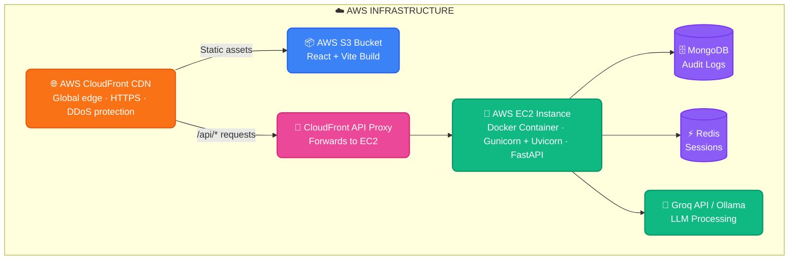
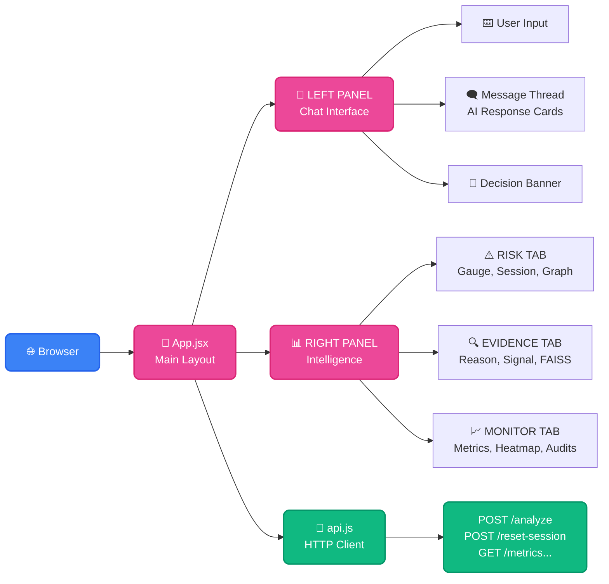
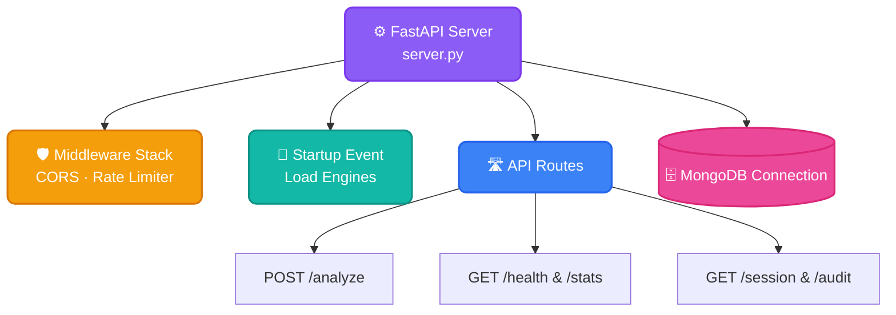
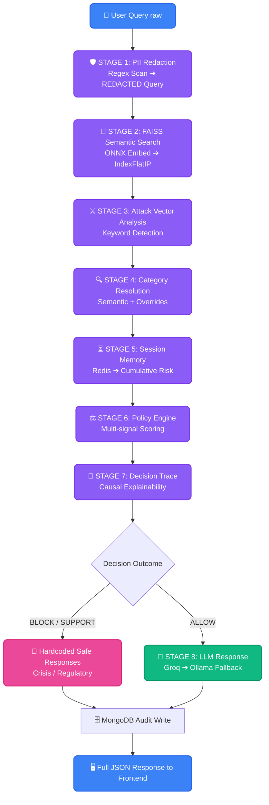
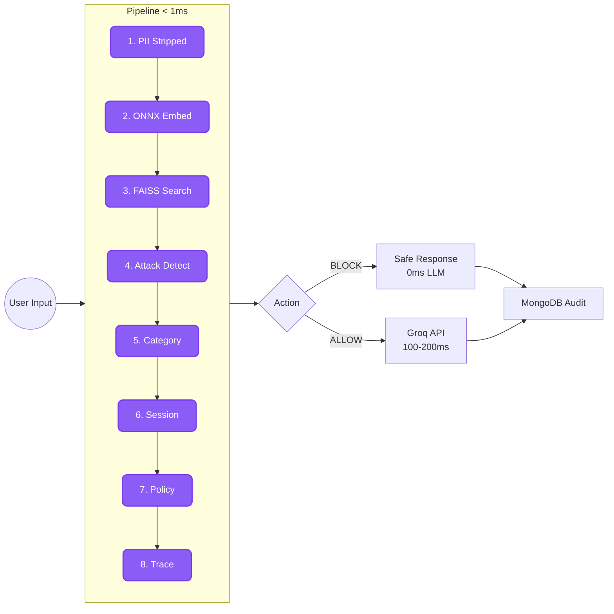

# Aegis AI — Complete System Architecture
**As-built | April 2026 | Chakravyuha V2.5 Demo**

---

## Full System Flow



---

## Frontend Architecture (React + Vite)



---

## Backend Architecture (FastAPI)



---

## Governance Pipeline — 8 Stages (pipeline.py)



---

## Data Flow Summary



---

## Data Stores

| Store | Technology | What It Holds | Durability |
|-------|-----------|---------------|------------|
| Audit Logs | MongoDB (motor async) | Every decision with full trace | Persistent |
| Session State | Redis → in-memory fallback | Per-user risk scores, history, distress | 24hr TTL |
| Vector Index | FAISS (in-memory) | 998 pre-computed embeddings | Rebuilt on startup |
| ONNX Model | File (onnx_model/) | Query embedding weights | Static file |
| LLM Response Cache | In-memory dict | Query → structured response | 5 min TTL |
| Policy Dataset | MongoDB + CSV/JSONL | Training data (downloadable) | Persistent |

---

## API Endpoints (Complete)

| Method | Path | Purpose | Auth |
|--------|------|---------|------|
| POST | /api/analyze | Main governance — analyze a query | Rate-limited (60/min) |
| GET | /api/health | Liveness + engine ready flag | None |
| GET | /api/stats | FAISS stats (vectors, categories) | None |
| GET | /api/metrics | Request counters + avg latency | None |
| GET | /api/session/{id} | Raw session state | None |
| POST | /api/reset-session | Clear session | None |
| GET | /api/audit | Last 50 audit log entries (MongoDB) | None |
| GET | /api/heatmap | Category × signal frequency heatmap | None |
| POST | /api/override | Admin override (unauthenticated — known V3 gap) | ⚠️ None |
| GET | /api/dataset/files | List downloadable dataset files | None |
| GET | /api/dataset/download/{key} | Download CSV or JSONL dataset | None |

---

## Frontend Components Map

| Component | Tab | Data Source | What It Shows |
|-----------|-----|------------|---------------|
| DecisionBanner | Top bar | latestResult | Full-width color bar — BLOCK/SUPPORT/ALLOW |
| RiskBar | Chat bubble | result.risk_score | Inline 0–100 visual bar per message |
| ExplainPanel | Chat bubble | result.decision_trace | Expandable causal trace in message |
| RiskGauge | Risk tab | result.risk_score | Animated circular risk dial |
| DecisionComparator | Risk tab | result.decision_trace.comparator | BLOCK score vs ALLOW score side-by-side |
| SessionPanel | Risk tab | result.session | Turn count, cumulative risk, distress, escalation |
| RiskGraph | Risk tab | result.session.risk_history | Line chart — risk + distress over turns |
| SignalBreakdown | Evidence tab | result.signal_breakdown | Semantic + session + policy weight bars |
| EvidencePanel | Evidence tab | result.evidence_spans | FAISS nearest-neighbor phrase matches |
| Timeline | Evidence tab | result.timeline | Per-stage latency waterfall |
| MetricsPanel | Monitor tab | GET /api/metrics | Total requests, errors, avg latency |
| HeatmapPanel | Monitor tab | GET /api/heatmap | Category × sub-signal frequency grid |
| AuditLogs | Monitor tab | GET /api/audit | Last 50 MongoDB decisions, live-refresh |

---

## Environment Variables Required

```bash
# Backend (.env)
MONGO_URL=mongodb+srv://...        # MongoDB Atlas or local
DB_NAME=aegis_production
GROQ_API_KEY=gsk_...               # Groq API key
REDIS_URL=redis://...              # Optional — falls back to in-memory
RATE_LIMIT=60/minute               # Configurable rate limit
CORS_ORIGINS=https://your-cdn.cloudfront.net

# Frontend (.env)
VITE_API_BASE=https://api.your-domain.cloudfront.net/api
```

---

*Aegis AI | Chakravyuha V2.5 | Built by Jaswanth | April 2026*
